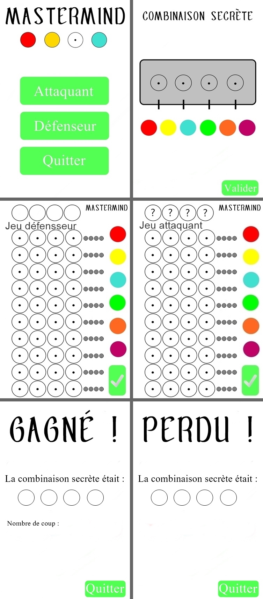

> Projet en C - DUT Informatique 2016

## Mastermind
```
Le Mastermind ou Master Mind est un jeu de société pour deux joueurs dont le but est de trouver un code. C'est un jeu de réflexion, et de déduction, inventé par Mordecai Meirowitz dans les années 1970.

Il se présente généralement sous la forme d'un plateau perforé de 10 rangées de quatre trous pouvant accueillir des pions de couleurs.
Le nombre de pions de couleurs différentes est de 8 et les huit couleurs sont généralement : rouge ; jaune ; vert ; bleu ; orange ; blanc ; violet ; rose.
Il y a également des pions blancs et rouges (ou noirs) utilisés pour donner des indications à chaque étape du jeu.
Il existe de nombreuses variantes suivant le nombre de couleurs, de rangées ou de trous.
```
#### Principe :
```
Un joueur commence par placer son choix de pions sans qu'ils soient vus de l'autre joueur à l'arrière d'un cache qui les masquera à la vue de celui-ci jusqu'à la fin de la manche.

Le joueur qui n'a pas sélectionné les pions doit trouver quels sont les quatre pions, c'est-à-dire leurs couleurs et positions.
Pour cela, à chaque tour, le joueur doit se servir de pions pour remplir une rangée selon l'idée qu'il se fait des pions dissimulés.

Une fois les pions placés, l'autre joueur indique :

  1. le nombre de pions de la bonne couleur bien placés en utilisant le même nombre de pions rouges.
  2. le nombre de pions de la bonne couleur, mais mal placés, avec les pions blancs.

Il arrive donc surtout en début de partie qu'il ne fasse rien concrètement et qu'il n'ait à dire qu'aucun pion ne correspond, en couleur ou en couleur et position.

La tactique du joueur actif consiste à sélectionner en fonction des coups précédents, couleurs et positions, de manière à obtenir le maximum d'informations de la réponse du partenaire puisque le nombre de propositions est limité par le nombre de rangées de trous du jeu. Dans la plupart des cas, il s'efforce de se rapprocher le plus possible de la solution, compte tenu des réponses précédentes, mais il peut aussi former une combinaison dans le seul but de vérifier une partie des conclusions des coups précédents et de faire en conséquence la proposition la plus propice à la déduction d'une nouvelle information.

Le joueur gagne cette manche s'il donne la bonne combinaison de pions sur la dernière rangée ou avant. Dans tous les cas, c'est à son tour de choisir les pions à découvrir. Mais il est interdit de mettre une couleur en double, en triple ou en quadruple aussi bien dans les pions secrets que dans les pions "publics".
```



<hr />
